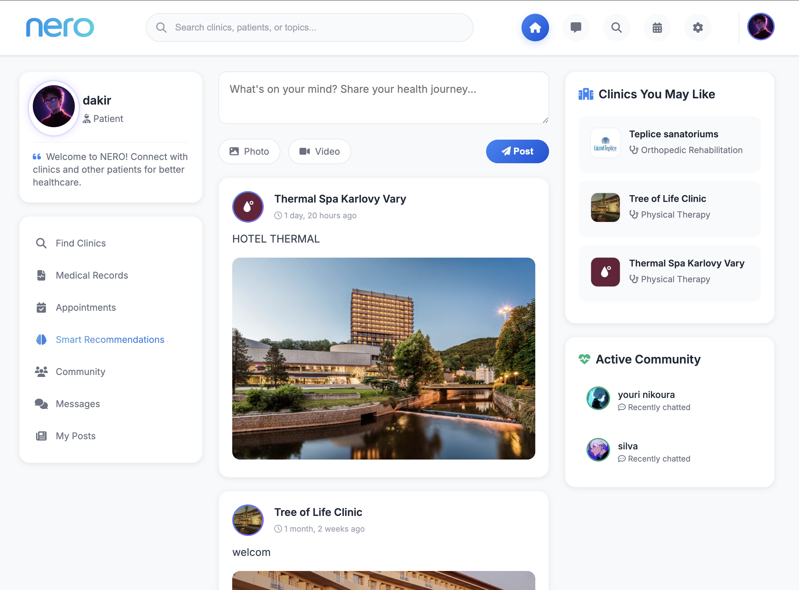

# Nero — Rehabilitation Care Platform

A web platform connecting **patients** with **rehabilitation clinics**, streamlining discovery, communication, and care management.

---

## What It Does

Nero bridges the gap between patients seeking rehabilitation services and clinics offering them. Patients can discover clinics, read reviews, upload medical records, and communicate directly with care providers — all in one place.

---

## Features

### For Patients
- Profile management with profile picture upload
- Secure medical record uploads (encrypted storage, file type & size validation)
- Browse and search clinics by specialization, city, and services
- Smart clinic recommendation engine with price-range filtering
- Rate and review clinics
- Real-time messaging with clinics

### For Clinics
- Full clinic profile (specialization, facilities, services, Google Maps embed)
- Post updates with images and videos
- Manage incoming patient inquiries via chat
- Receive and display patient reviews with star ratings
- Track patient activity and engagement

### General
- Dual account types: `patient` and `clinic`
- Google OAuth login (via `django-allauth`)
- Unread message badge across the platform
- Admin dashboard for full platform management

---

## Integrations

| Integration | Purpose |
|---|---|
| **django-allauth** | Email & Google OAuth authentication |
| **Google OAuth 2.0** | Social login for patients and clinics |
| **Pillow** | Image processing for uploads |
| **Gunicorn** | Production WSGI server |
| **WhiteNoise** | Efficient static file serving |
| **python-decouple** | Environment variable management |
| **PyJWT** | JSON Web Token support |

---

## Security

- **Argon2 password hashing** — industry-standard, memory-hard hashing via `argon2-cffi`
- **Brute-force IP blocking** — failed login attempts trigger temporary blocks; IPs blocked 3+ times are permanently banned
- **CSRF protection** — all forms protected by Django's built-in CSRF middleware
- **Clickjacking protection** — `X-Frame-Options` header enforced globally
- **Password validation** — enforces minimum length, complexity, and rejects common passwords
- **File upload validation** — strict extension allowlists and file size limits (3 MB for profiles, 50 MB for records)
- **Encrypted file storage** — medical records stored with encrypted filesystem backend
- **Environment secrets** — sensitive keys loaded from `.env`, never hardcoded in production
- **Session security** — Django's secure session middleware stack

---

## Tech Stack

- **Backend:** Django 4.2, Python 3
- **Database:** SQLite (development) — swap to PostgreSQL for production
- **Frontend:** Django Templates, HTML/CSS, JavaScript
- **Auth:** django-allauth + Google OAuth 2.0
- **Storage:** Local filesystem with encrypted backend for sensitive files
- **Deployment:** PythonAnywhere (`haroune120.pythonanywhere.com`)

---

## Getting Started

### Option 1 — Docker (recommended, fastest)

> Requires [Docker](https://www.docker.com/) and Docker Compose.

```bash
# 1. Clone the repo
git clone <repo-url>
cd Nero_

# 2. Set up environment variables
cp .env.example .env   # fill in your values

# 3. Build and start
docker compose up --build

# 4. Run migrations (first time only)
docker compose exec web python manage.py migrate

# 5. Create a superuser (optional)
docker compose exec web python manage.py createsuperuser
```

The app will be available at **http://localhost:8000**

---

### Option 2 — Local setup

```bash
# 1. Clone the repo
git clone <repo-url>
cd Nero_

# 2. Create and activate a virtual environment
python -m venv .venv
source .venv/bin/activate

# 3. Install dependencies
pip install -r requirements.txt

# 4. Set up environment variables
cp .env.example .env   # fill in your values

# 5. Run migrations
python manage.py migrate

# 6. Start the development server
python manage.py runserver
```

---

## Environment Variables

| Variable | Description |
|---|---|
| `SECRET_KEY` | Django secret key |
| `SITE_ID` | django-allauth site ID |
| `GOOGLE_CLIENT_ID` | Google OAuth client ID |
| `GOOGLE_CLIENT_SECRET` | Google OAuth client secret |

---

## License

This project was built as a thesis project. All rights reserved.
